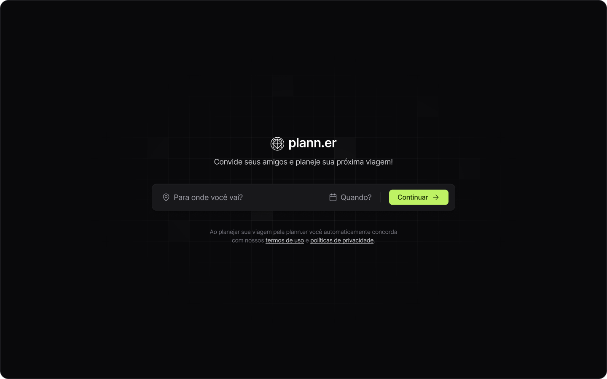

# Plann.er - Frontend




## Descrição
O Projeto Journey tem como objetivo ajudar os usuários a organizar suas viagens, sejam elas a trabalho ou lazer. O sistema permite que os usuários criem e gerenciem viagens de forma eficiente, fornecendo funcionalidades para o planejamento detalhado de cada dia da viagem.

## Instruções de instalação
### Pré requisitos
- NodeJS 18 ou superior
- Git

### Etapas
1. Clone o repositório na sua máquina
```bash
git clone https://github.com/lucasmoraist/plann.er-frontend.git
```
2. Instale as dependências do projeto  
```bash
npm install
```
3. Rode o projeto
```bash
npm run dev
```

## Instruções de Uso
1. Tenha o backend rodando na máquina
1. Com ambos projetos rodando já será possível fazer as requisições e testar o funcionamente do projeto

## Rotas do projeto
| route               | description                                          
|----------------------|-----------------------------------------------------
| <kbd>/</kbd>     | tela inicial, para criação de viagem
| <kbd>/trips/:tripId</kbd>     | tela da viagem com suas respectivas atividades

## Contribuição
Contribuições são bem-vindas! Sinta-se à vontade para enviar pull requests com melhorias, correções de bugs ou novos recursos.

## Contatos
<a href = "mailto:luksmnt1101@gmail.com">
  
</a>
<a href="https://www.linkedin.com/in/lucas-morais-152672219/" target="_blank">
  
</a>
